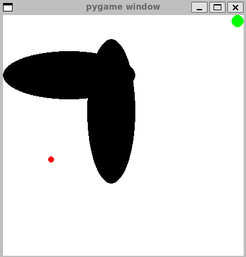

# Reviving Puddle World - Upper Bound (2024) AI Competition
Puddle World is an environment that got traction in the 1990s which was studied by [Boyan and Moore (1995)](https://proceedings.neurips.cc/paper/1994/file/ef50c335cca9f340bde656363ebd02fd-Paper.pdf) and then later picked up by Rich Sutton in the same year. The agent starts at an initial state (denoted in red) in the Puddle World and the task for the agent is to navigate around the puddles (denoted in black) to reach the goal state (denoted in green). 

In the Puddle World, there are four actions, up, down, right, and left, which moves the agent approximately 0.05 in these directions unless the movement would cause the agent to leave the limits of the space. A random gaussian noise with standard deviation 0.01 is also added to the action along both dimensions. 
The reward for this task is −1 for each time step, with additional penalties if either or both of the two oval “puddles” were entered. These penalties are -400 times the distance into the puddle (distance to the nearest edge).
 The puddles's top left position is [0. , 0.85] and [0.35, 0.9] respectively, and the width and height for them is [0.55, 0.2 ] and [0.2, 0.6].
 The start state is located at [0.2, 0.4], and the goal is to reach [1.0, 1.0].

You can find more information about the environment in the paper [Generalization in Reinforcement Learning: Successful Examples Using Sparse Coarse Coding](https://proceedings.neurips.cc/paper_files/paper/1995/hash/8f1d43620bc6bb580df6e80b0dc05c48-Abstract.html)

This repository is an extension of the previous open-source implementation of the environment. This implementation is compatible with the gymnasium library, making it easy to interact with the environment.

<p align="center">
  <kbd>
    
  </kbd>
</p>

## Installation
Make a virtual env for your project

```python
python -m venv myenv
source myenv/bin/activate
```

Then navigate to the library directory and run this line in the library directory.

```python
pip install -e .
```

You can also find the details about the needed python and library versions in `setup.py`.

## Usage
```python
import gymnasium as gym
import gym_puddle # Don't forget this extra line!

env = gym.make('PuddleWorld-v0')
```

##  Configurations
Your task is to train an agent that can generalize well across different provided configurations of the environment. Each of these configurations feature different positions for puddles, which makes it challenging for the agent to find the most rewarding path to the goal.

You can find these configurations in the `env_configs` folder of the repository. 
You can specify one of the `.json` files for the various environment configurations provided, where `pw1.json` corresponds to the original Puddle World environment in the paper.
You can then intitialize the Puddle World as mentioned in the  `getting_started.ipynb` Colab guide.
Here is a snippet of how you can intitalize your environment with the desired configuration:

```python
json_file = 'path/to/json/' #include the path to the json file here
with open(json_file) as f:
  env_setup = json.load(f) #load the json file with the environment configuration
env = gym.make( #initialize the environment with the corresponding values
  "PuddleWorld-v0",
  start=env_setup["start"],
  goal=env_setup["goal"],
  goal_threshold=env_setup["goal_threshold"],
  noise=env_setup["noise"],
  thrust=env_setup["thrust"],
  puddle_top_left=env_setup["puddle_top_left"],
  puddle_width=env_setup["puddle_width"],
)

```


# More Details and Getting Started
For more details on how to get started with the environment, refer to `getting_started.ipynb` Colab file. In this guide, we go through how to install the environment, the environment details, and how to initialize an instance with the desired configurations. 

Furthermore, we show you how to visualize the environment, and how you can run a random, human, and DQN agent on the environment. We illustrate how a simple training loop would look like and provide guidance on how to make a submission file for the Kaggle Competition.
